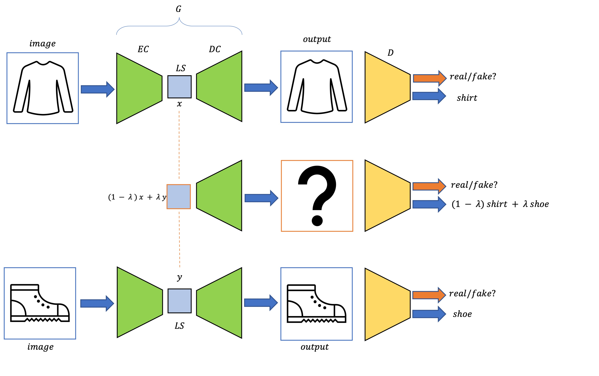
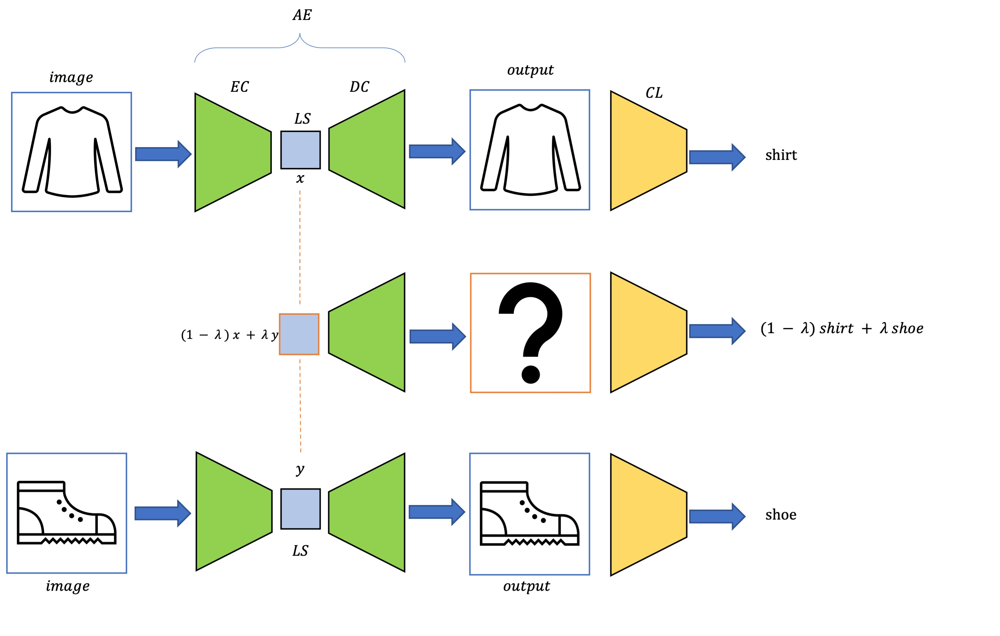

# Interpolating Autoencoder Project

This is a personal Deep Learning project using PyTorch which aims at investigating an idea of using the interpolated labels with a classifier during the training of an autoencoder. 
More precisely, during training, interpolated samples will be generated in the latent space which will then be decoded by the autoencoder and classified by the classifier. 
These interpolated predictions should then be interpolation of the corresponding labels. 
See the following figure for an explanation.




In a first part, this will be done with an ordinary classifier and autoencoder, in a second part part with a GAN using a similar architecture. 
Then, the quality of the generated interpolations and latent space embeddings will be investigated as well. 

## Packages
To run the code, you first need to have the installed packages. 
In your virtual environment, run
```
pip install -r requirements.txt
```
and you should be good to go. 

## TODO
* Find better values for GAN
* Move code to `.py` files
* Experiment with `BATCH_SIZE`/`dim` tradeoff
* Update explanations
* Add "GIF matrix" for interpolation between multiple samples at the same time